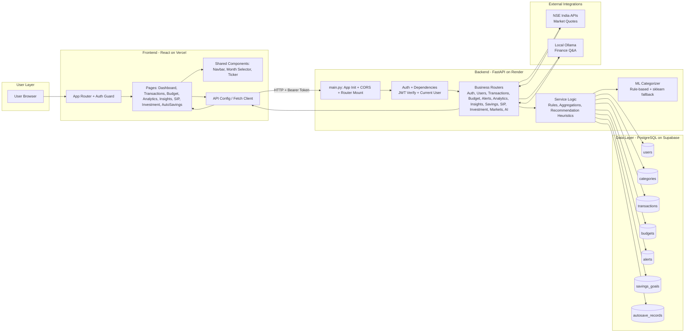
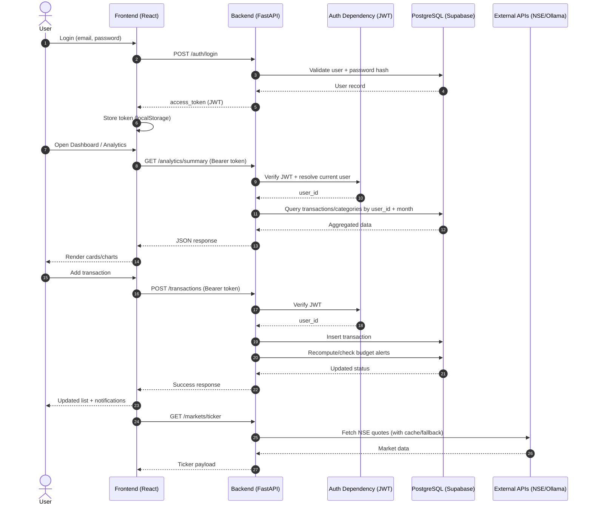

# FinSmart Architecture Diagrams

## 1) High-Level System Architecture

```mermaid
flowchart LR
  subgraph U[User Layer]
    A[User Browser]
  end

  subgraph FE[Frontend - React on Vercel]
    B[App Router + Auth Guard]
    C[Pages: Dashboard, Transactions, Budget, Analytics, Insights, SIP, Investment, AutoSavings]
    D[Shared Components: Navbar, Month Selector, Ticker]
    E[API Config / Fetch Client]
  end

  subgraph BE[Backend - FastAPI on Render]
    F[main.py: App Init + CORS + Router Mount]
    G[Auth + Dependencies\nJWT Verify + Current User]
    H[Business Routers\nAuth, Users, Transactions, Budget, Alerts, Analytics, Insights, Savings, SIP, Investment, Markets, AI]
    I[Service Logic\nRules, Aggregations, Recommendation Heuristics]
    J[ML Categorizer\nRule-based + sklearn fallback]
  end

  subgraph DB[Data Layer - PostgreSQL on Supabase]
    K[(users)]
    L[(categories)]
    M[(transactions)]
    N[(budgets)]
    O[(alerts)]
    P[(savings_goals)]
    Q[(autosave_records)]
  end

  subgraph EXT[External Integrations]
    R[NSE India APIs\nMarket Quotes]
    S[Local Ollama\nFinance Q&A]
  end

  A --> B
  B --> C
  C --> D
  C --> E
  E -->|HTTP + Bearer Token| F

  F --> G
  G --> H
  H --> I
  I --> J

  I --> K
  I --> L
  I --> M
  I --> N
  I --> O
  I --> P
  I --> Q

  H --> R
  H --> S

  R --> H
  S --> H
  H --> E
  E --> C
```

## 2) Request/Response Sequence (Login + Protected APIs)

```mermaid
sequenceDiagram
    autonumber
    actor U as User
    participant FE as Frontend (React)
    participant BE as Backend (FastAPI)
    participant AUTH as Auth Dependency (JWT)
    participant DB as PostgreSQL (Supabase)
    participant EXT as External APIs (NSE/Ollama)

    U->>FE: Login (email, password)
    FE->>BE: POST /auth/login
    BE->>DB: Validate user + password hash
    DB-->>BE: User record
    BE-->>FE: access_token (JWT)
    FE->>FE: Store token (localStorage)

    U->>FE: Open Dashboard / Analytics
    FE->>BE: GET /analytics/summary (Bearer token)
    BE->>AUTH: Verify JWT + resolve current user
    AUTH-->>BE: user_id
    BE->>DB: Query transactions/categories by user_id + month
    DB-->>BE: Aggregated data
    BE-->>FE: JSON response
    FE-->>U: Render cards/charts

    U->>FE: Add transaction
    FE->>BE: POST /transactions (Bearer token)
    BE->>AUTH: Verify JWT
    AUTH-->>BE: user_id
    BE->>DB: Insert transaction
    BE->>DB: Recompute/check budget alerts
    DB-->>BE: Updated status
    BE-->>FE: Success response
    FE-->>U: Updated list + notifications

    FE->>BE: GET /markets/ticker
    BE->>EXT: Fetch NSE quotes (with cache/fallback)
    EXT-->>BE: Market data
    BE-->>FE: Ticker payload
```
